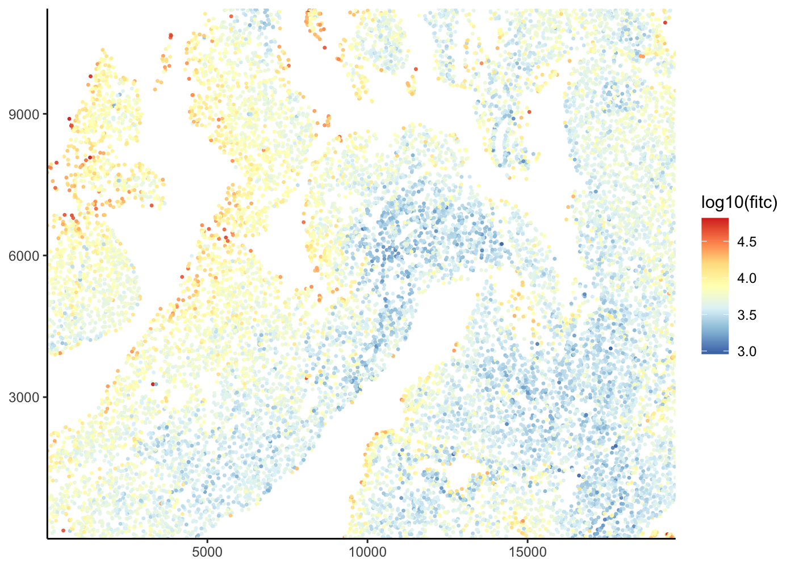
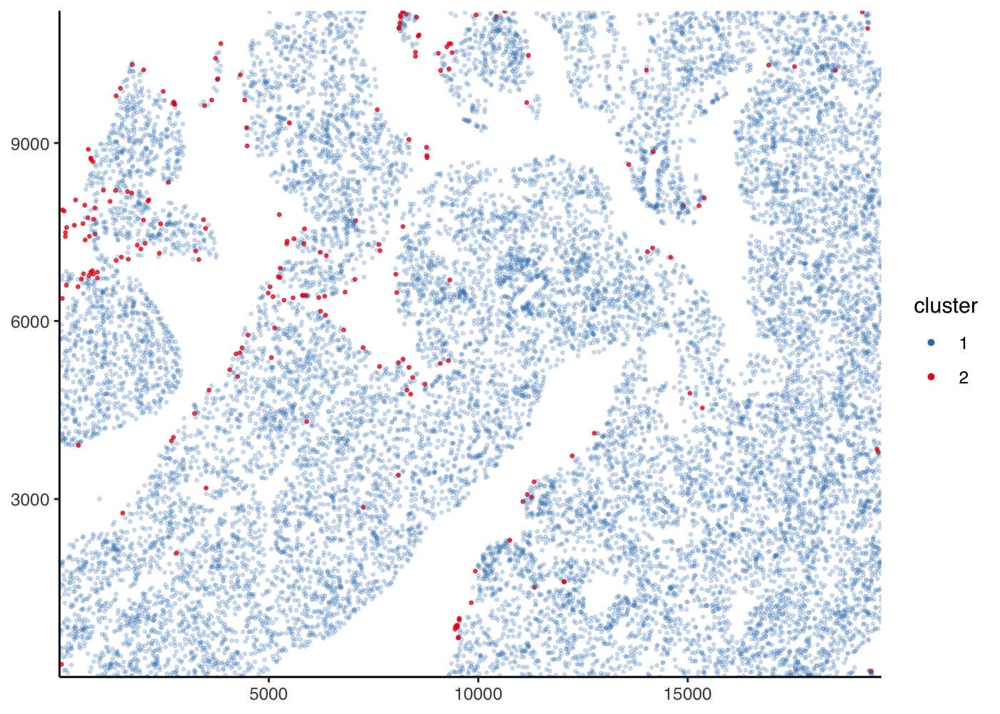

<!-- README.md is generated from README.Rmd. Please edit that file -->

# PackageBluishgreen

<!-- badges: start -->

[](https://github.com/Kevin-Haigis-Lab/PackageBluishgreen/actions)
[](https://www.tidyverse.org/lifecycle/#experimental)
<!-- badges: end -->

The goal of `PackageBluishgreen` is to package the internals for
clustering cells for Olesja Popow (pronounced “po-pow”). The cells were
identified using a separate algorithm which output DAPI and FITC values
for each cell into a CSV. This package maintains this data in a data
structure called `tissue_slide` and manages any classification methods
applied to the cells.

## Installation

You can install the released version of ‘PackageBluishgreen’ from
[GitHub](https://github.com/Kevin-Haigis-Lab/PackageBluishgreen) with:

``` r
#> If using 'renv'
renv::install("Kevin-Haigis-Lab/PackageBluishgreen")
#> else
devtools::install_github("Kevin-Haigis-Lab/PackageBluishgreen")
```

**The full documentation can be found
[here](https://kevin-haigis-lab.github.io/PackageBluishgreen/). For
examples, check out the
[vignettes](https://kevin-haigis-lab.github.io/PackageBluishgreen/articles/).**

If there is a specific classification method you would like, please open
an
[issue](https://github.com/Kevin-Haigis-Lab/PackageBluishgreen/issues)
on GitHub.

## Example usage

``` r
library(PackageBluishgreen)
```

### The *tissue slide* data structure

The *tissue slide* class is designed to hold three things:

1.  the signal intensity data from a microscopy slide
2.  metadata for the samples
3.  classification methods and results

A new tissue slide can be created by just passing in the slide data.

``` r
pancreas_data <- read.csv(system.file(
  "extdata",
  "unmicst-OP1181_pancreas_TUNEL_01.csv",
  package = "PackageBluishgreen"
))

pancreas_data <- pancreas_data[, c(1, 3:5)]
colnames(pancreas_data) <- c("cell_id", "fitc", "x", "y")

pancreas_slide <- tissue_slide(pancreas_data, metadata = list(tissue = "pancreas", mouse = "OP1181"))
```

The metadata can be easily retrieved.

``` r
get_slide_metadata(pancreas_slide)
#> $tissue
#> [1] "pancreas"
#> 
#> $mouse
#> [1] "OP1181"
```

It is also very easy to plot the data.

``` r
plot_tissue(pancreas_slide, color = log10(fitc))
```



### Manual classification

A more thorough guide can be found in the [“Manual
classification”](https://kevin-haigis-lab.github.io/PackageBluishgreen/articles/manual-classification.html)
vignette.

The `cluster_manually()` function should be used to apply a manual
classification cutoff to the data.

``` r
pancreas_slide <- cluster_manually(pancreas_slide, fitc, 4.3, transform = log10)
```

The results can be easily plotted.

``` r
plot_slide_clusters(pancreas_slide, method = "manual")
```



A summary of the results can be obtained using the
`summarize_cluster_results()` function.

``` r
summarize_cluster_results(pancreas_slide)
#> # A tibble: 2 x 2
#>   manual_cluster     n
#> * <fct>          <int>
#> 1 1              66244
#> 2 2                787
```

------------------------------------------------------------------------

Mistakes or questions? Open an
[issue](https://github.com/Kevin-Haigis-Lab/PackageBluishgreen/issues)
on Github.
