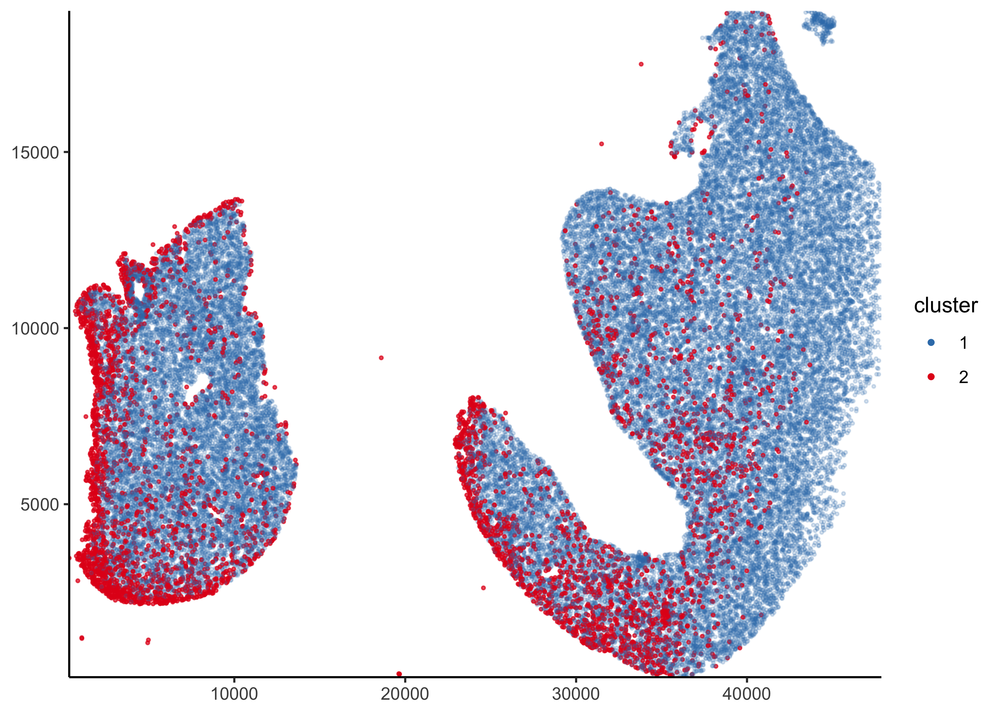
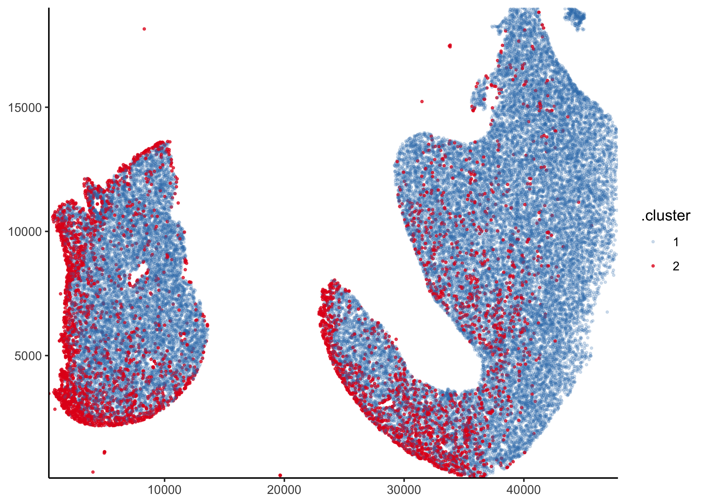

<!-- README.md is generated from README.Rmd. Please edit that file -->

# PackageBluishgreen

<!-- badges: start -->

[](https://github.com/Kevin-Haigis-Lab/PackageBluishgreen/actions)
<!-- badges: end -->

The goal of PackageBluishgreen is to …

## Installation

You can install the released version of PackageBluishgreen from
[CRAN](https://CRAN.R-project.org) with:

``` r
install.packages("PackageBluishgreen")
```

## Example

This is a basic example which shows you how to solve a common problem:

``` r
library(PackageBluishgreen)

lung_data <- system.file("extdata", "unmicst-OP1165_liver_TUNEL_01.csv", package = "PackageBluishgreen") %>%
  readr::read_csv(col_types = readr::cols()) %>%
  janitor::clean_names() %>%
  select(
    cell_id,
    x = x_centroid,
    y = y_centroid,
    dapi = dapi_nuclei_mask,
    fitc = fitc_nuclei_mask,
    area:orientation
  )

head(lung_data)
#> # A tibble: 6 x 12
#>   cell_id      x     y   dapi   fitc  area major_axis_leng… minor_axis_leng…
#>     <dbl>  <dbl> <dbl>  <dbl>  <dbl> <dbl>            <dbl>            <dbl>
#> 1       1 20775.  5.19 14990. 29994.   117             15.2            10.3 
#> 2       2 36155. 54.6  16403. 15586.    95             13.5             9.07
#> 3       3 36103. 70.5  28111.  2954.   359             27.2            17.3 
#> 4       4 35866. 69.2  14360. 35306.   249             32.1             9.99
#> 5       5 36045. 76.5  27555.  9761.   277             21.4            16.5 
#> 6       6 36004. 83.2  32704.  2969.   824             35.0            30.0 
#> # … with 4 more variables: eccentricity <dbl>, solidity <dbl>, extent <dbl>,
#> #   orientation <dbl>
```

``` r
new_manual_classification <- function(assignments = factor(), cutoff = double(), transform = identity) {
  stopifnot(is.factor(assignments))
  stopifnot(is.numeric(cutoff))
  stopifnot(is.function(transform))
  structure(
    assignments,
    cutoff = cutoff,
    transform = transform,
    class = c("manual_classification", "factor")
  )
}

validate_manual_classification <- function(mc) {
  stopifnot(is.factor(mc))
  stopifnot(is.numeric(attr(mc, "cutoff")))
  stopifnot(is.function(attr(mc, "transform")))
  return(TRUE)
}

manual_classification <- function(assignments = factor(), cutoff = NA_real_, transform = identity) {
  if (is.list(assignments)) {
    assignments <- unlist(assignments)
  }
  if (!is.factor(assignments)) {
    assignments <- factor(assignments)
  }

  mc <- new_manual_classification(assignments = assignments, cutoff = cutoff, transform = transform)

  validate_manual_classification(mc)
  return(mc)
}

mc <- manual_classification()
```

``` r
new_tissue_slide <- function(data = tibble()) {
  stopifnot(inherits(data, "data.frame"))
  structure(
    data,
    manual_class = manual_classification(),
    class = c("tissue_slide", class(tibble()))
  )
}

validate_tissue_slide <- function(ts) {
  stopifnot(inherits(ts, "tissue_slide"))
  stopifnot(inherits(ts, "data.frame"))
  assertr::verify(ts, assertr::has_all_names("x", "y", "fitc"))

  stopifnot(inherits(attr(ts, "manual_class"), "manual_classification"))

  return(TRUE)
}

get_manual_classification <- function(ts) {
  validate_tissue_slide(ts)
  attr(ts, "manual_class")
}

set_manual_classification <- function(ts, manual_class) {
  validate_tissue_slide(ts)
  validate_manual_classification(manual_class)
  attr(ts, "manual_class") <- manual_class
  validate_tissue_slide(ts)
  return(ts)
}

tissue_slide <- function(slide_data) {
  new_tissue_slide(slide_data)
}

lung_slide <- new_tissue_slide(lung_data)
validate_tissue_slide(lung_slide)
#> [1] TRUE
```

``` r
standard_tissue_plot <- function(p) {
  p +
    scale_x_continuous(expand = expansion(c(0, 0))) +
    scale_y_continuous(expand = expansion(c(0, 0))) +
    theme_classic() %+replace%
    theme(axis.title = element_blank())
}

plot_tissue <- function(ts, prop = 0.25) {
  validate_tissue_slide(ts)
  p <- ts %>%
    slice_sample(prop = prop) %>%
    ggplot(aes(x = x, y = y, color = log10(fitc))) +
    geom_point(size = 0.5, alpha = 0.9)

  standard_tissue_plot(p) +
    scale_color_distiller(type = "div", palette = "RdYlBu") +
    labs(color = "log10(FITC)")
}

plot_tissue(lung_slide)
```


``` r
plot_fitc_density <- function(ts) {
  ts %>%
    ggplot(aes(x = log10(fitc))) +
    geom_density(alpha = 0.1, size = 0.8, color = "black", fill = "black") +
    scale_y_continuous(expand = expansion(c(0, 0.02))) +
    theme_classic() +
    labs(x = "log10(FITC)", y = "density")
}

plot_fitc_density(lung_slide)
```



``` r
cluster_manually <- function(ts, cutoff, transform = identity) {
  validate_tissue_slide(ts)
  mc <- manual_classification(
    assignments = ifelse(transform(ts$fitc) < cutoff, 1, 2),
    cutoff = cutoff,
    transform = transform
  )
  ts <- set_manual_classification(ts, mc)
  validate_tissue_slide(ts)
  return(ts)
}
```

``` r
lung_slide <- cluster_manually(lung_slide, cutoff = 4, transform = log10)
```

``` r
plot_slide_clusters <- function(ts, cluster = "manual", prop = 0.25) {
  ts$.cluster <- get_manual_classification(ts)
  ts <- slice_sample(ts, prop = prop)
  p <- ggplot(ts, aes(x = x, y = y, color = .cluster, alpha = .cluster)) +
    geom_point(size = 0.5)

  standard_tissue_plot(p) +
    scale_color_brewer(type = "qual", palette = "Set1", direction = -1) +
    scale_alpha_manual(values = c(0.2, 0.7))
}
```

``` r
plot_slide_clusters(lung_slide)
```


