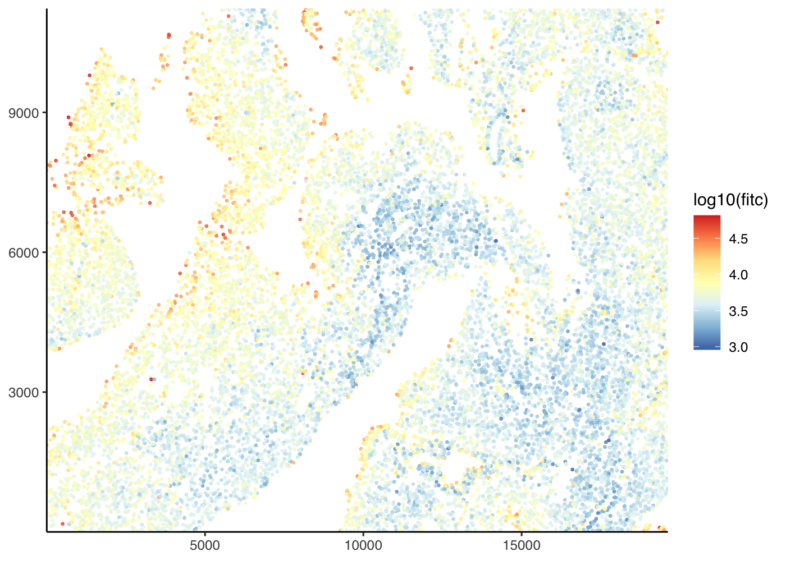
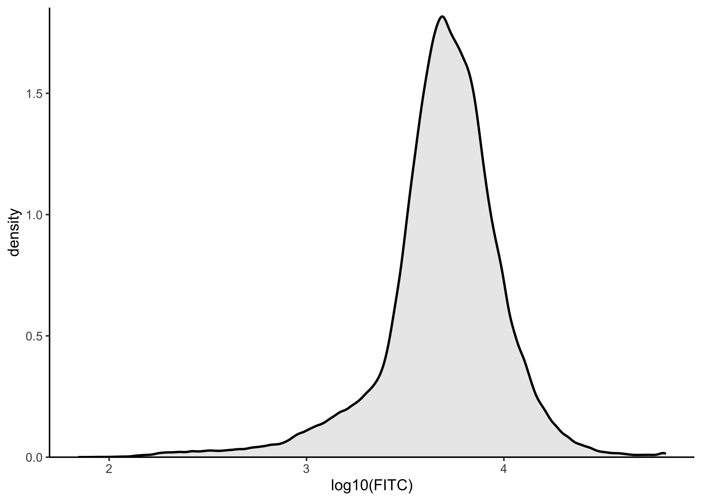

<!-- README.md is generated from README.Rmd. Please edit that file -->

# PackageBluishgreen

<!-- badges: start -->

[](https://github.com/Kevin-Haigis-Lab/PackageBluishgreen/actions)
[](https://www.tidyverse.org/lifecycle/#experimental)
<!-- badges: end -->

The goal of `PackageBluishgreen` is to package the internals for
clustering cells for Olesja Popow (pronounced “po-pow”). The cells were
identified using the TUNEL algorithm which output DAPI and FITC values
for each cell into a CSV. This package takes these outputs and clusters
them by their FITC intensity.

> This package is still under development and the API may change.

## Installation

You can install the released version of ‘PackageBluishgreen’ from
[GitHub](https://github.com/Kevin-Haigis-Lab/PackageBluishgreen) with:

``` r
#> If using 'renv'
renv::install("Kevin-Haigis-Lab/PackageBluishgreen")
#> else
devtools::install_github("Kevin-Haigis-Lab/PackageBluishgreen")
```

## Example

This is a basic example with some data from a lung slide.

``` r
library(PackageBluishgreen)

lung_data <- system.file(
  "extdata",
  "unmicst-OP1165_liver_TUNEL_01.csv",
  package = "PackageBluishgreen"
) %>%
  readr::read_csv(col_types = readr::cols()) %>%
  janitor::clean_names() %>%
  select(
    cell_id,
    x = x_centroid,
    y = y_centroid,
    dapi = dapi_nuclei_mask,
    fitc = fitc_nuclei_mask,
    area:orientation
  )

head(lung_data)
#> # A tibble: 6 x 12
#>   cell_id      x     y   dapi   fitc  area major_axis_leng… minor_axis_leng…
#>     <dbl>  <dbl> <dbl>  <dbl>  <dbl> <dbl>            <dbl>            <dbl>
#> 1       1 20775.  5.19 14990. 29994.   117             15.2            10.3 
#> 2       2 36155. 54.6  16403. 15586.    95             13.5             9.07
#> 3       3 36103. 70.5  28111.  2954.   359             27.2            17.3 
#> 4       4 35866. 69.2  14360. 35306.   249             32.1             9.99
#> 5       5 36045. 76.5  27555.  9761.   277             21.4            16.5 
#> 6       6 36004. 83.2  32704.  2969.   824             35.0            30.0 
#> # … with 4 more variables: eccentricity <dbl>, solidity <dbl>, extent <dbl>,
#> #   orientation <dbl>
```

``` r
lung_slide <- tissue_slide(lung_data)
```

The slide can store metadata, too. It can be added to the slide when it
is instantiated with `tissue_slide()` using the `metadata` parameter or
can be added to an existing tissue slide object using
`set_slide_metadata()`

``` r
lung_slide <- set_slide_metadata(lung_slide, list(tissue = "lung", mouse = "OP24"))
get_slide_metadata(lung_slide)
#> $tissue
#> [1] "lung"
#> 
#> $mouse
#> [1] "OP24"
```

``` r
plot_tissue(lung_slide, color = log10(fitc))
```



``` r
plot_density(lung_slide, value = fitc)
```



``` r
lung_slide <- cluster_manually(lung_slide, fitc, cutoff = 4, transform = log10)
plot_slide_clusters(lung_slide)
```


``` r
summarize_cluster_results(lung_slide)
#> # A tibble: 2 x 2
#>   manual_cluster      n
#> * <fct>           <int>
#> 1 1              153258
#> 2 2               19132
```
